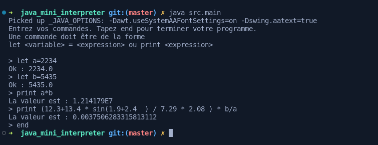

# Mini interpreter of arethmetic operations written in JAVA

It has 3 commands :
```
    let <variable> = <expression>
    print <expression>
    end
```    
    
It has 6 built-in functions: sin, cos, tan, abs, sqrt et log.



Realized by [CreponneKarim](https://github.com/CreponneKarim) and myself. 
